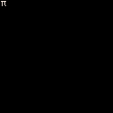

# Pi game template 

This is a template for writing new games powered by [Pi](https://github.com/elgopher/pi).

## What's in the box? 

* sprite-sheet file with 16 colors palette from [Pico-8](https://www.lexaloffle.com/pico-8.php).
* the sprite-sheet file has one sprite with number 0
* project is a Go module importing all the necessary dependencies
* main.go file contains code running the game
* game code is inside game package
* two variants of code: for development (with devtools) and production (no devtools)

## How to use it?

* [Go 1.18+](https://go.dev/dl/) is required
* Use any Go editor such as [Visual Studio Code](https://code.visualstudio.com/) or [GoLand](https://www.jetbrains.com/go/)
* If not on Windows, please install additional dependencies for [Linux](https://github.com/elgopher/pi/blob/master/docs/install-linux.md) or [macOS](https://github.com/elgopher/pi/blob/master/docs/install-macos.md)
* Run the game with ```go run .``` (or run directly from your editor)

## Howtos

### How to rename the module?

* this template has a module named `github.com/elgopher/pi-template`
* edit the go.mod and replace the module name with your own, e.g. `module github.com/you/name`
* do the same with import in main.go

### How to create production build (with no devtools)?

```sh
go build -tags prod .
```